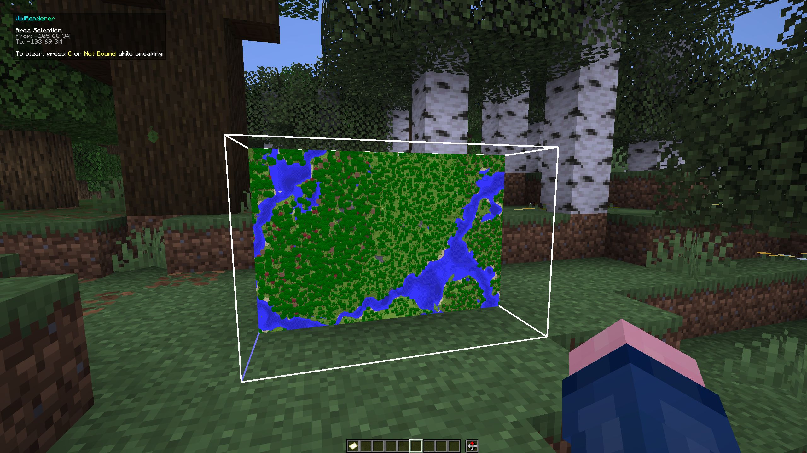
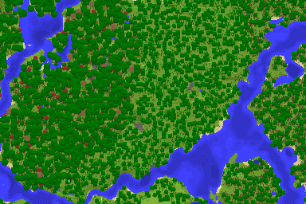
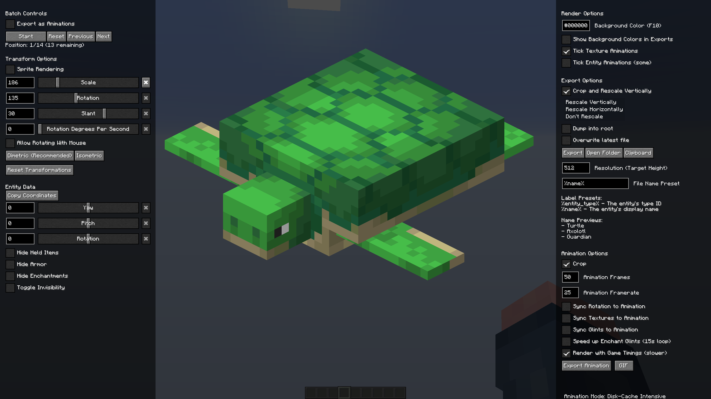
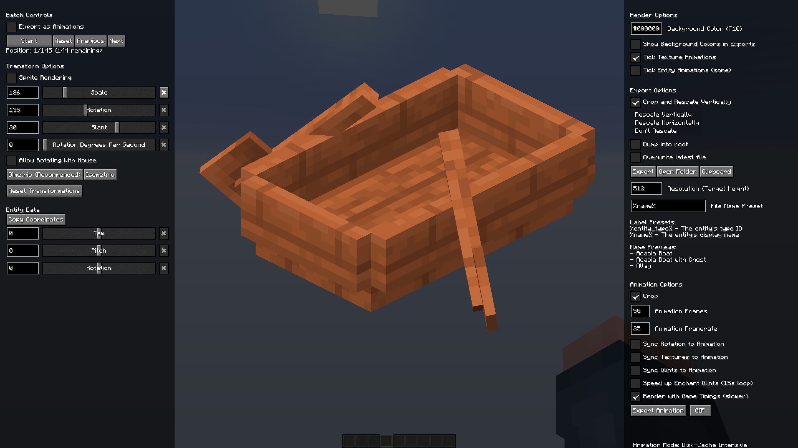
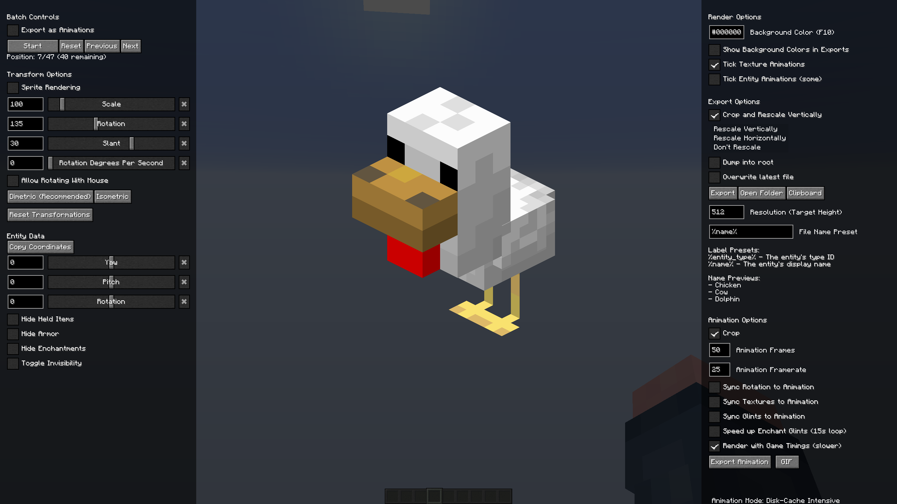

# WikiRenderer
WikiRenderer 是 MOD [Isometric Renders](https://github.com/gliscowo/isometric-renders) 高度修改的版本，允许你创建游戏内对象的渲染，如世界的一部分、方块、物品和实体。

游戏会自动设置透明背景，你可以在游戏内的菜单中调整比例、位置等多种选项。

这个版本的模组不仅是为模组维基设计的，还包含了一些面向 [Hypixel SkyBlock Wiki](https://hypixel-skyblock.fandom.com) 的额外功能。

> 注意：WIkiRenderer 在1.21.11版本中依赖 MOD [owo-lib](https://modrinth.com/mod/owo-lib) ，您可以在[这里](https://modrinth.com/mod/owo-lib/versions)下载此 MOD。

# 用途
WikiRenderer 支持以下渲染类型：

- 物品
- 实体
    - 还支持精灵图（即实体头部）渲染
- 世界区域
    - 还支持可用于小地图的俯视图
- 不同状态的方块
- 物品提示框
- 批量渲染多个方块或物品
    - 可以从创造模式标签页、物品命名空间或你的物品栏中选取
    - 还可以将多个物品渲染到同一图集中
- 物品、实体、不同状态的方块或世界区域可以以动画形式导出 （格式为 `.gif`， `.apng`， `.webp`，或 `.mp4` ）

主命令是 `/wikirender`，可以简写为 `/wr`。

## 物品
物品可以通过三种方式渲染：
1. 手持物品输入： `/wikirender item`
2. 鼠标悬停在物品栏中的物品上，按下渲染快捷键（默认为 `h`）
3. 输入 `/wikirender item id <item>`， 其中  `<item>` 类似于 `minecraft:diamond`
4. 输入 `/wikirender item texture <item>`, 其中 `<texture>` 是一个纹理 ID 或 base64 编码的玩家头颅纹理 ID

下面是一个用指令 `/wikirender item id minecraft:compass[minecraft:enchantment_glint_override=true]` 渲染的已附魔的指南针:

右侧有一个选项，可以加快附魔光效闪烁速度。通常，在 100% 闪光速度时（见 Minecraft 的无障碍设置）时，闪烁动画需要 41.25 秒才能循环一次，但这个选项会将其加速到 15 秒，几乎没有明显差别。点击 `Use Enchanted Items Timings`（`同步为动画时长`） 按钮后，会将导出的动画时长设置为加速后的时长（即上文的 15 秒）。

玩家头部也可以被渲染，你也可以用附带的按钮获取他们的纹理数据：

## 区域

世界中的区域可以用三种方式渲染：
1. 使用快捷键 （默认为 `c`）选取世界中的两个点，然后输入 `/wikirender area`。
2. 输入 `/wikirender area pos <start> <end>`， 其中 `<start>` 和 `<end>` 代表两个点的坐标。
3.  输入 `/wikirender area island <chunk_size> <distance_limit>`，该命令会以迷你区块（由 `<chunk_size>` 指定其大小）为单位向外扫描，遇到空区块时会停止，或在达到距离限制时停止。
    - 此命令适用于快速渲染你附近的所有区域，或渲染靠近其他岛屿的非正方形岛屿。在后一种情况下，只需降低 `<chunk_size>`，直到扫描范围不再触及周围的岛屿。

下方是使用 `/wikirender area island 8 200` 渲染的 Hypixel 大厅示例，菜单两侧展示了多种渲染选项：

区域渲染器的可配置性很高。你可以控制方块与实体的可见性、覆盖特定类型实体的显示规则、修改光照的处理方式，以及进行更多其他自定义设置。

### 小地图渲染
区域渲染还提供俯视和侧视渲染模式，可让你创建类似小地图的图像，并支持可调节的分辨率和缩放。此外还有一个洞穴模式，可用于生成地下洞穴的可视化图像。

小地图数据可被导出并用于： [Hypixel SkyBlock Fandom Wiki's Module:Minimap/Datasheet Minimap Calibrator tool](https://hypixel-skyblock.fandom.com/wiki/Module:Minimap/Datasheet).

### 物品展示框内地图
 关于小地图，你还可以使用区域渲染和侧视角来渲染像素级完美的地图。这些图像使用与源地图图像完全相同的色彩数据和亮度渲染：

## 实体
实体可以通过四种方式渲染：
1. 输入 `/wikirender player` 来渲染你自己
2. 看向一个实体，然后按下渲染快捷键 （默认为 `h`）
3. 看向一个实体，然后输入 `/wikirender entity`
4. 输入 `/wikirender entity <entity_type> <nbt>`，其中 `<entity_type>` 类似于 `minecraft:zombie`； `<nbt>` 为可选项，类似于 `{IsBaby:1b}`

下方是我自己（即作者 Pigicial）的渲染示例，分别为普通模式和可选的精灵图（即头部渲染）模式：

实体渲染支持多种自定义选项，包括：启用实体的实时状态（适合带动画的盔甲）、固定手臂姿态、切换物品 / 附魔的可见性，以及其他更多设置。

与头部物品渲染类似，你也可以提取已渲染玩家的纹理数据，以及被渲染实体所佩戴的玩家头颅纹理。

### 实体亮度规则
实体的光照规则如下：在等距视角（`45°`， `135°`， `225°` 和 `315°`）下，实体顶部为 100% 亮度，左侧为 80% 亮度，右侧为 60% 亮度。精灵图渲染时为 100% 亮度。

## 方块
单个方块及方块状态可通过三种方式渲染：
1. 注视一个方块并输入 `/wikirender block`
2. 输入 `/wikirender block <block>`，其中 `<block>` 类似 `minecraft:cobblestone`
3. 输入 `/wikirender block <block>[data]`，如下所示：

下面是一个用指令  `/wikirender block minecraft:furnace[lit=true]{Items:[{Slot:0b, Count: 1b, id: "minecraft:coal"}]}` ([绝对不是照抄人家等轴渲染wiki的示例](https://docs.wispforest.io/isometric-renders/slash_isorender#isorender-block)) 渲染熔炉的示例：

> 注意：所有含水方块目前无法正常渲染。对于这些，使用区域渲染单个方块来解决。

## 物品提示框
物品提示框的渲染方式与物品渲染类似：
1. 手持物品输入 `/wikirender tooltip`
2. 鼠标悬停在物品栏中的物品上，按下渲染提示框快捷键 （默认为 `k`）
3. 输入 `/wikirender tooltip <tooltip>`， 其中 `<item>` 类似于 `minecraft:diamond`

提示框采用逐像素分辨率缩放渲染，默认每 1 个字体像素对应 4 个图像像素。

## 基于物品的批量渲染
有多种方式可以一次性批量渲染多个物品、方块或物品提示框：

### 物品栏
要渲染你物品栏中的所有物品，按下对应的快捷键（默认为 `k`），这将打开一个弹窗，允许你选择：
- 渲染物品
- 渲染方块物品的所有状态
- 渲染物品提示框
- 或将物品整理为图集进行渲染

### 创造模式物品栏
要渲染一个创造模式物品栏标签页：
1. 输入 `/wikirender group item creative_tab <tab> itematlas`，将指定标签页渲染为一张纹理图集
2. 输入 `/wikirender group item creative_tab <tab> batch (blocks|items|tooltips)` ，批量渲染指定标签页内的物品、方块或物品提示框。

下方是一个使用命令 `/wikirender group item creative_tab minecraft:combat itematlas` 渲染的示例：战斗用品标签页渲染为一张图集。

### 带标签物品
要根据指定标签批量渲染物品、方块或物品提示框：
1. 输入 `/wikirender group item tag <#namespace:tag> itematlas`，将该标签下的所有物品渲染为一张纹理图集
2. 输入 `/wikirender group item tag <#namespace:tag> batch (blocks|items|tooltips)`，批量渲染该标签下的物品、方块或物品提示框。
下方是一个批量渲染所有花朵的示例，使用命令： `/wikirender group item tag #minecraft:flowers batch items`。屏幕左侧显示还剩 30 个物品待渲染，点击开始按钮即可完成全部渲染。

### 命名空间物品
要渲染来自指定命名空间的物品、方块或物品提示框：
1. 输入 `/wikirender group item namespace <namespace> itematlas`，将该命名空间下的所有物品渲染为一张纹理图集。
2. 输入 `/wikirender group item namespace <namespace> batch (blocks|items|tooltips)`，批量渲染该命名空间下的物品、方块或物品提示框。

下方是一个使用命令 `/wikirender group item namespace minecraft itematlas` 渲染的示例：将所有原版物品渲染为一张图集。

## 基于实体的批量渲染
有多种方式可以一次性批量渲染多个实体：
### 带标签实体
要根据指定标签批量渲染实体：
1. 输入 `/wikirender group entity tag <#namespace:tag>`，渲染该标签下的所有实体。
2. 输入 `/wikirender group entity tag <#namespace:tag> nbt <nbt>`，为该标签下的所有实体应用指定 NBT 数据后进行渲染。
3. 输入 `/wikirender group entity tag <#namespace:tag> nbt_filter <filter> <nbt>`，为该标签下的所有实体应用指定 NBT 数据，但仅渲染通过过滤器检查的实体（详见下文）。

下方是一个批量渲染所有 Minecraft 水生生物的示例，使用命令： `/wikirender group entity tag #minecraft:aquatic`

### 命名空间实体
要渲染来自指定命名空间的实体：
1. 输入 `/wikirender group entity namespace <namespace>`，渲染该命名空间下的所有实体。
2. 输入 `/wikirender group entity namespace <namespace> nbt <nbt>`，为该命名空间下的所有实体应用指定 NBT 数据后进行渲染。
3. 输入 `/wikirender group entity namespace <namespace> nbt_filter <filter> <nbt>`，为该命名空间下的所有实体应用指定 NBT 数据，但仅渲染通过过滤器检查的实体（详见下文）。

下方是一个批量渲染所有 Minecraft 生物的示例，使用命令： `/wikirender group entity namespace minecraft`:

### NBT 过滤：
在按命名空间或标签批量渲染实体时，你可以通过应用 NBT 数据来筛选实际要渲染的实体。共有三种过滤模式可供选择：
1. `require_all_valid`：仅当**所有**提供的 NBT 标签均有效时，才允许渲染该实体。
2. `require_one_valid`：只要**至少一个**提供的 NBT 标签有效，就允许渲染该实体。
3. `require_none_valid`：仅当所有提供的 NBT 标签**均无效时**，才允许渲染该实体。

更具体地说，“有效标签”指的是实体在保存 NBT 时会被一并存储的标签。
有些标签会对所有实体导出（例如所有活体实体的 `Equipment` 标签），无论它们是否会改变渲染外观；而另一些标签则仅会为特定类型实体保存（例如雪傀儡的 `Pumpkin` 标签）。

例如，输入命令： `/wikirender group entity namespace minecraft nbt_filter require_one_valid {Age:-1,IsBaby:1b}` 将渲染所有幼年生物，并会额外包含一些其他生物，如下方示例所示。

