# WikiRenderer

# Overview
WikiRenderer is a heavily modified version of [Isometric Renders](https://github.com/gliscowo/isometric-renders) that allows you to create renders of game objects like parts
of world, blocks, items and entities.

These are automatically keyed to have a transparent background, and you can adjust scale, positioning and many more
options right in-game in a menu.

Not only is this version of the mod also designed for modded wikis in mind, but it also has a couple of additional
features targeted for use on the [Hypixel SkyBlock Wiki](https://hypixel-skyblock.fandom.com).

## Dependencies
WikiRenderer relies on [owo-lib](https://modrinth.com/mod/owo-lib), which hasn't formally been released for 1.21.11 yet. It has however been updated and is available in a [branch in the main repository](https://github.com/wisp-forest/owo-lib/tree/1.21.11), it just has to be manually built.

# Usage
WikiRenderer supports the following render types:

- Items
- Entities
    - Also supports sprite rendering
- Areas in the world
    - Also supports overhead images for minimaps
- Block States
- Item Tooltips
- Batch export of multiple blocks or items
    - Can pull from creative tabs, item namespaces, or your inventory
    - Can also render multiple items into an atlas
- Animated exports for items, entities, blocks states or world areas (in `.gif`, `.apng`, `.webp`, or `.mp4` formats)

## Items
Items can be rendered in three ways:
1. Hold an item and type `/wikirender item`
2. Hover over an item in your inventory and press the render hotkey (defaults to `h`)
3. Type `/wikirender item <item>`, where `<item>` is something like `minecraft:diamond`

Below is an example of an enchanted compass made using `/wikirender item minecraft:compass[minecraft:enchantment_glint_override=true]`:

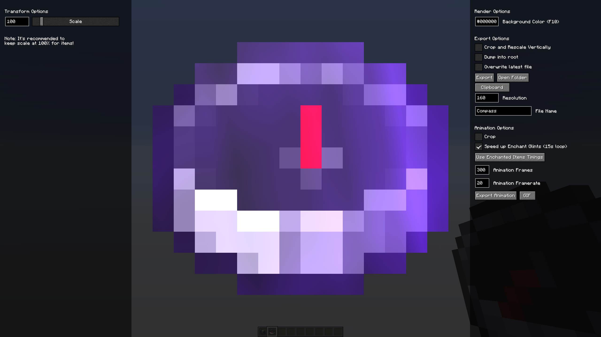

On the right is an option to speed up enchantment glint speeds. Normally, at 100% glint speed (seen in Minecraft's accessibility settings), a full loop of the glint animation takes 41.25 seconds, but this option speeds it up to 15 seconds, while barely being a noticeable difference.  The `Use Enchanted Items Timings` button then sets the animation timing settings to this duration.

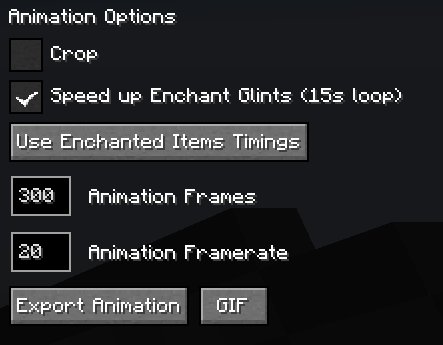

Player Heads can also be rendered, and you can also grab their texture data with included buttons:

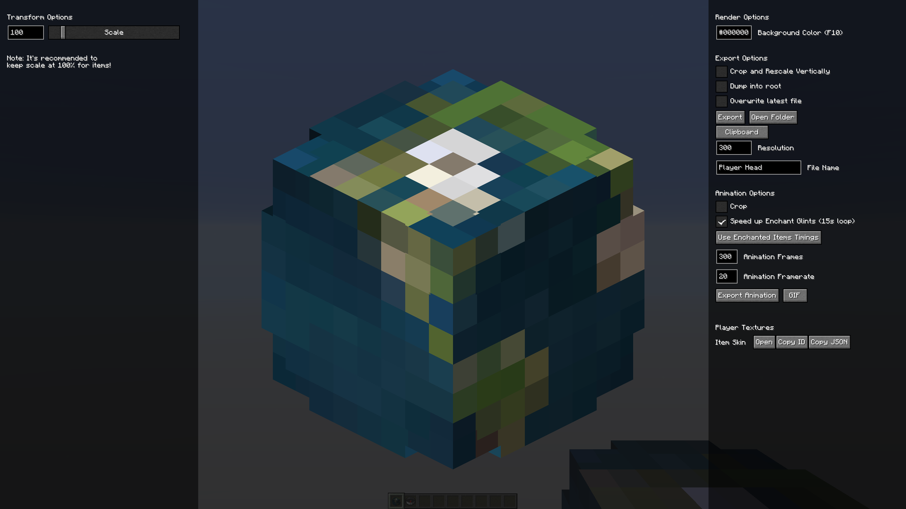

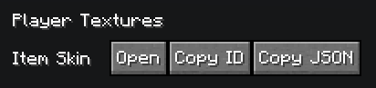

## Areas

Areas in the world can be rendered in three ways:
1. Select two points in the world with the hotkey (defaults to `c`), and type `/wikirender area`.
2. Type `/wikirender area pos <start> <end>`, where `<start>` and `<end>` represent coordinates.
3. Type `/wikirender area island <chunk_size> <distance_limit>`, which scans outwards in mini chunks (specified by
   `<chunk_size>`), not continuing past empty chunks or until the distance limit is reached.
    - This is useful for rendering everything nearby you quickly, or for rendering a non-square-shaped island close to
      other islands. In the latter case, simply lower `<chunk_size>` until the surrounding islands are not hit in the
      scan.

Below is an example of the Hypixel Prototype lobby, rendered using `/wikirender area island 8 200`, featuring a variety of render options on both sides of the menu:

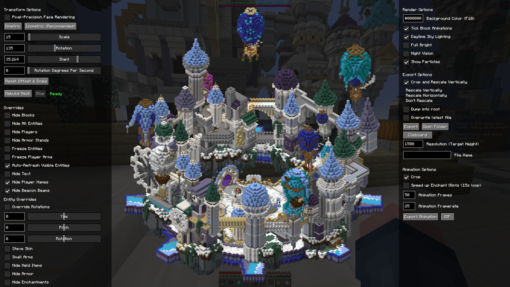

Area renders are quite configurable. You can control block and entity visibility, override certain types of data on visible entities, modify how lighting is handled, and more.

### Minimap Renders
Area renders also feature topdown and side-view rendering modes, which allow you to create minimap images with adjustable texture resolution scaling. There is also a cave mode that lets you create underground images.

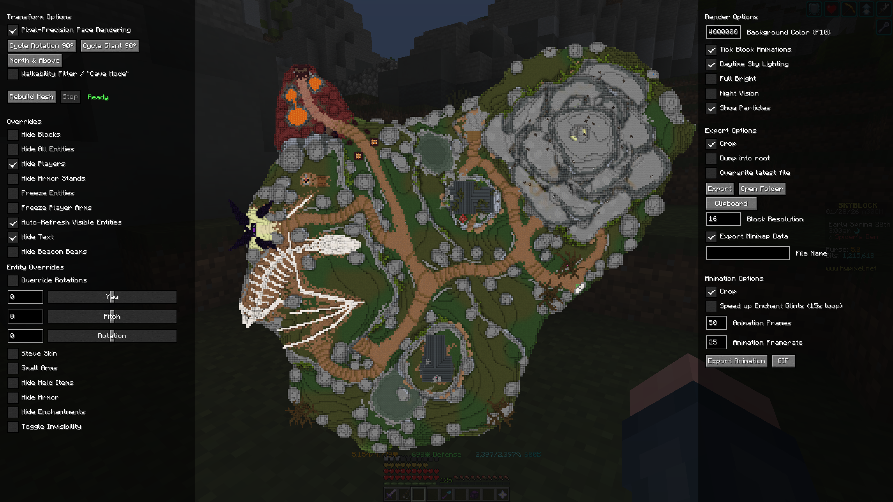
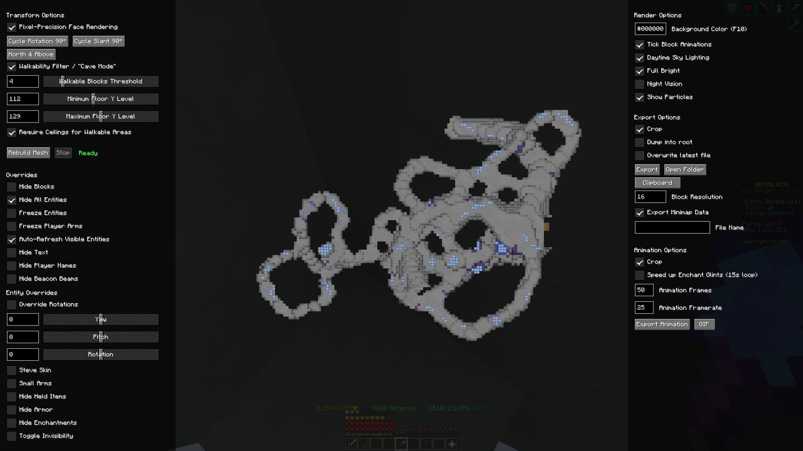

Minimap data can also be exported for use on the [Hypixel SkyBlock Fandom Wiki's Module:Minimap/Datasheet Minimap Calibrator tool](https://hypixel-skyblock.fandom.com/wiki/Module:Minimap/Datasheet).

## Entities
Entities can be rendered in four ways:
1. Type `/wikirender player` to render yourself
2. Look at an entity and pressing the render hotkey (defaults to `h`)
3. Look at an entity and type `/wikirender entity`
4. Type `/wikirender entity <entity_type> <nbt>`, where `<entity_type>` is something like `minecraft:zombie`, and `<nbt>` is optional but something like `{IsBaby:1b}`

Below are examples of myself being rendered, both normally and in an optional sprite mode:

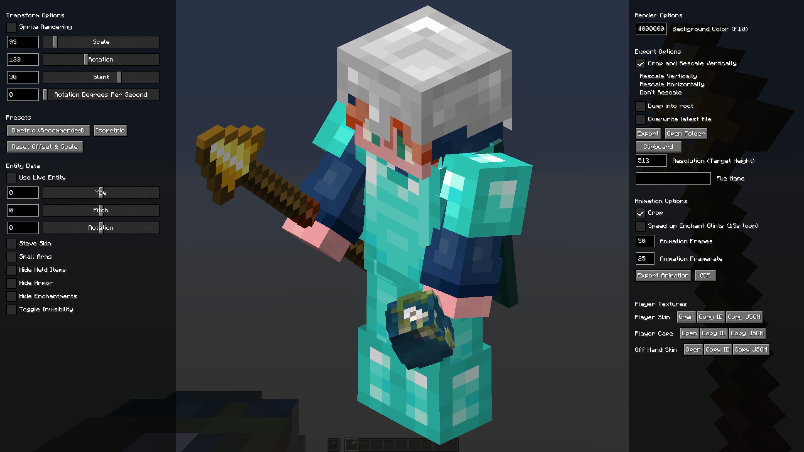
**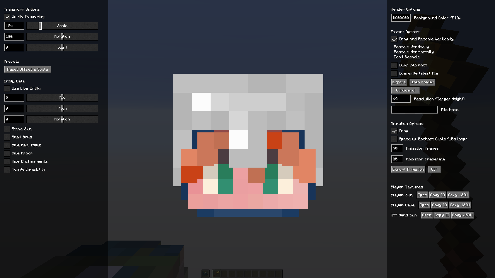**

Similar to player head item renders, you can also grab the texture data of rendered players, as well as player heads worn or held by rendered entities.

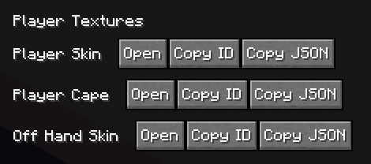

### Entity Lighting
Entities are lit in a way where in isometric viewing angles (`45°`, `135°`, `225°`, and `315°`), the top is 100% brightness, the left side is 80% brightness, and the right side is 60% brightness. Sprites are rendered at 100% brightness.

## Blocks
Individual blocks and block states can be rendered in three ways:
1. Look at a block and type `/wikirender block`
2. Type `/wikirender block <block>`, where `<block>` is something like `minecraft:cobblestone`
3. Type `/wikirender block <block>[data]`, as seen below

Below is an example of rendering a furnace using `/wikirender block minecraft:furnace[lit=true]{Items:[{Slot:0b, Count: 1b, id: "minecraft:coal"}]}` ([definitely not a copied command](https://docs.wispforest.io/isometric-renders/slash_isorender#isorender-block))

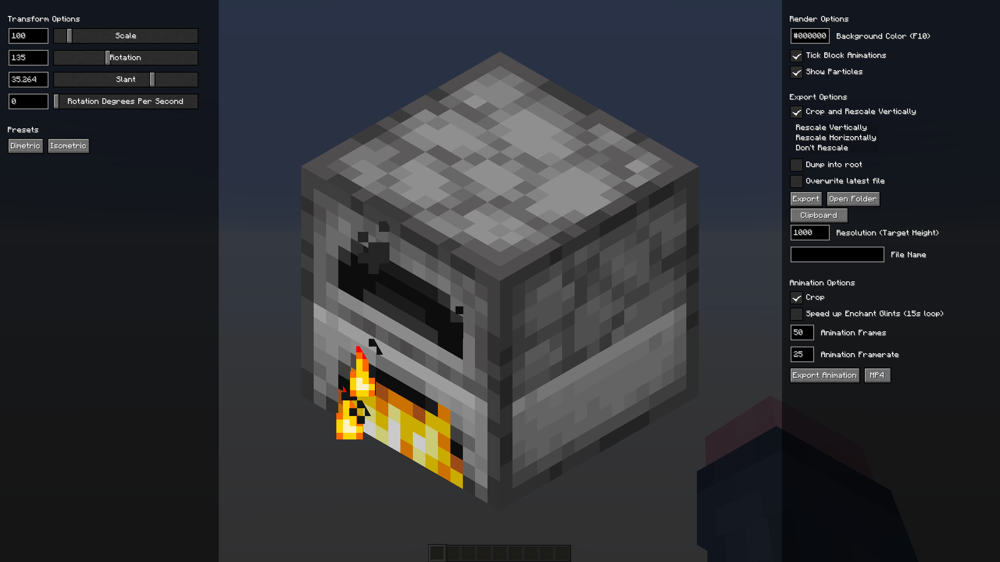

> Note: Waterlogged blocks currently do not render properly. For those, use a single-block area render.

## Item Tooltips
Item Tooltips can be rendered in similar ways to item renders:
1. Hold an item and type `/wikirender tooltip`
2. Hover over an item in your inventory and press the render tooltip hotkey (defaults to `k`)
3. Type `/wikirender tooltip <tooltip>`, where `<item>` is something like `minecraft:diamond`

Tooltips are rendered using per-pixel resolution scaling, defaulting at 4 image pixels per font pixel.

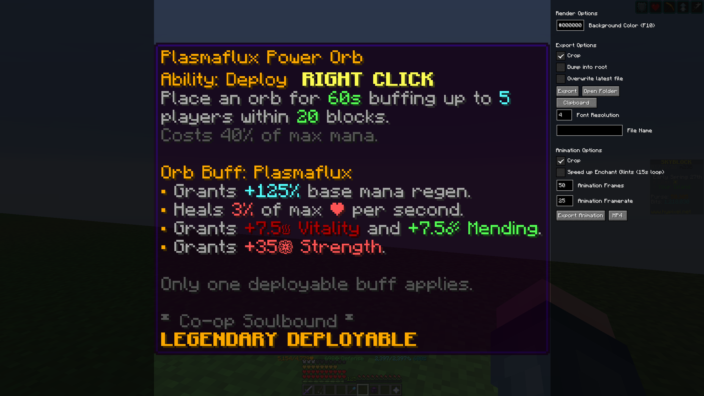

## Batch Rendering
There are several ways to multiple render items, blocks, or tooltips at once:

### Inventories
To render every item in your inventory, press the associated hotkey (default `k`), which will open a popup allowing you to render the items, block item states, tooltips, or items in an atlas:

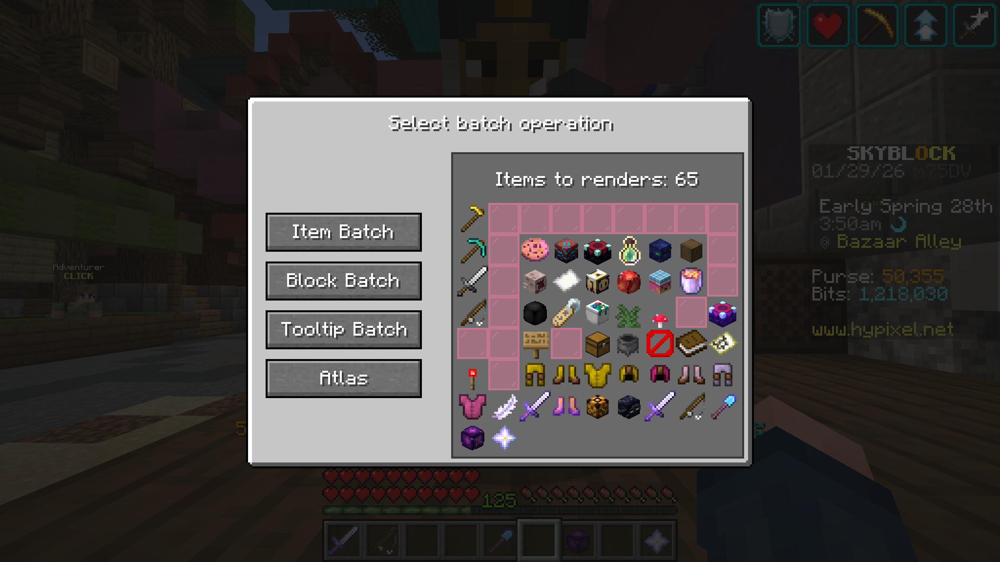

### Creative Tabs
To render a creative tab:
1. Type `/wikirender creative_tab <tab> atlas` to render a certain tab as an atlas texture
2. Type `/wikirender creative_tab <tab> batch (blocks|items|tooltips)` to batch render a certain tab's items, blocks, or tooltips

Below is an example of every combat item rendered in an atlas using `/wikirender creative_tab minecraft:combat atlas`:

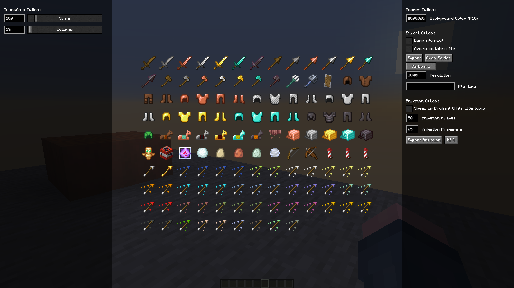

### Tagged Items
To render items, blocks or tooltips given a select tag:
1. Type `/wikirender tag <#tag:tag> atlas` to render the tag's items as an atlas texture
2. Type `/wikirender tag <#namespace:tag> batch (blocks|items|tooltips)` to batch render the tag's items, blocks, or tooltips

Below is an example of a batch render of every flower using `/wikirender tag #minecraft:flowers batch items`. The left side of the screen shows 30 items remaining, and they can all be rendered by pressing the start button.

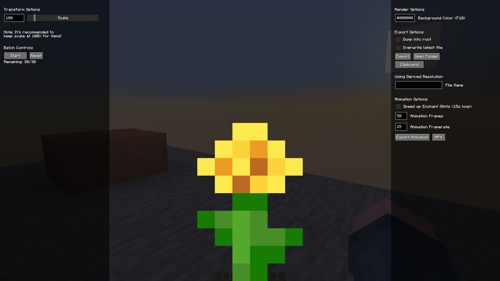

### Namespace Items
To render items, blocks or tooltips from a select namespace:
1. Type `/wikirender namespace <namespace> atlas` to render the namespace's items as an atlas texture
2. Type `/wikirender namespace <namespace> batch (blocks|items|tooltips)` to batch render the namespace's items, blocks, or tooltips

Below is an example of an atlas render of every vanilla item using `/wikirender namespace minecraft atlas`.

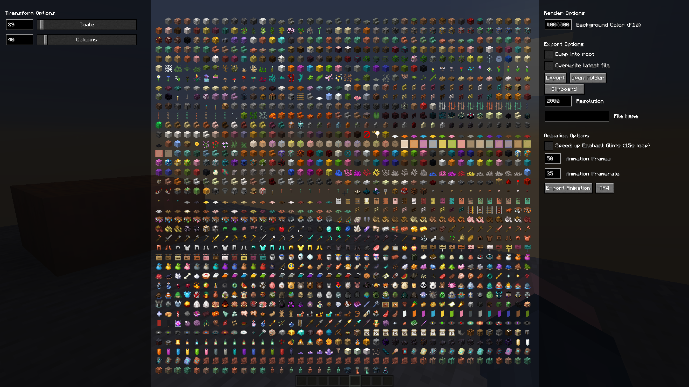
